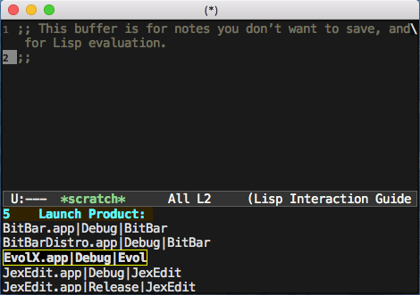

# xcode-product
 Launch xcode products (build results) from within emacs.

 This script depends on ivy https://github.com/abo-abo/swiper

 Usage:
 ```
 (require 'xcode-product)
 (global-set-key (kbd "f6") 'xcode-product-launch)

 ```

 

 这是我首个lisp程序习作, 经测试能在 Xcode 7.3 默认环境下工作.
